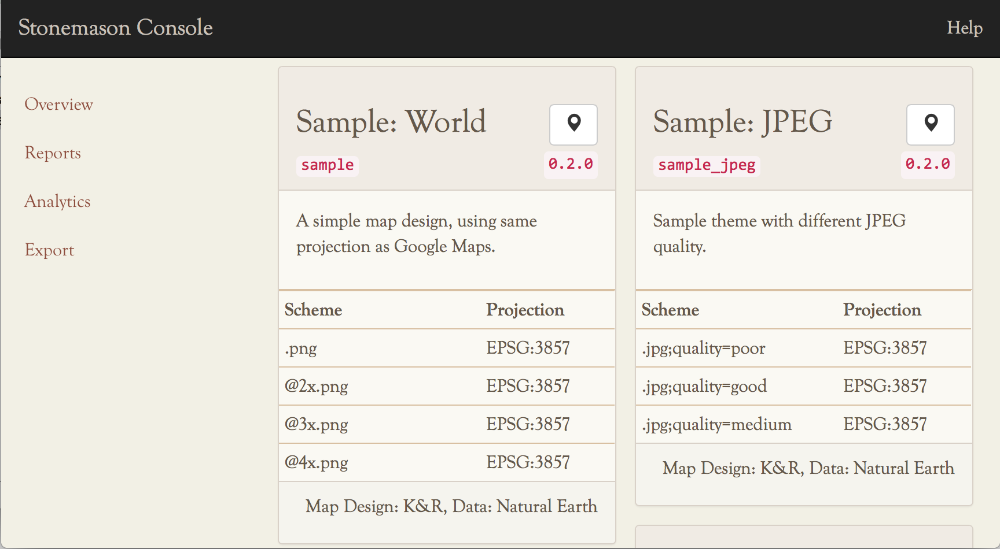
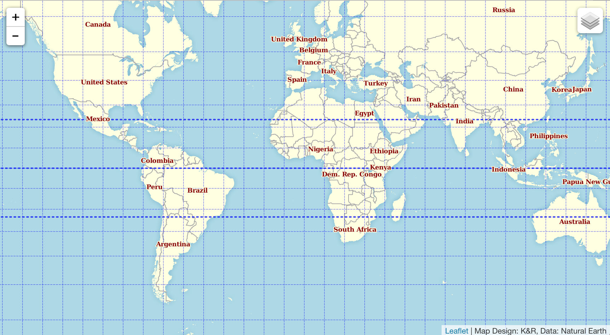
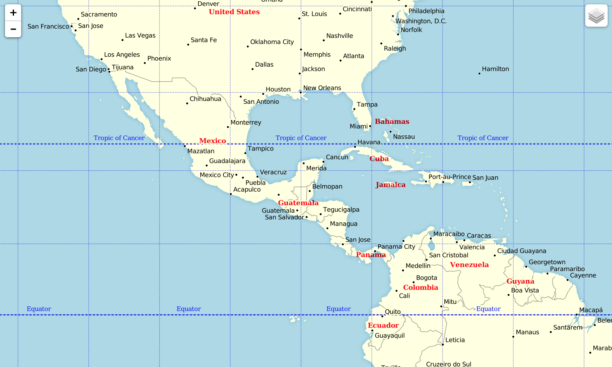
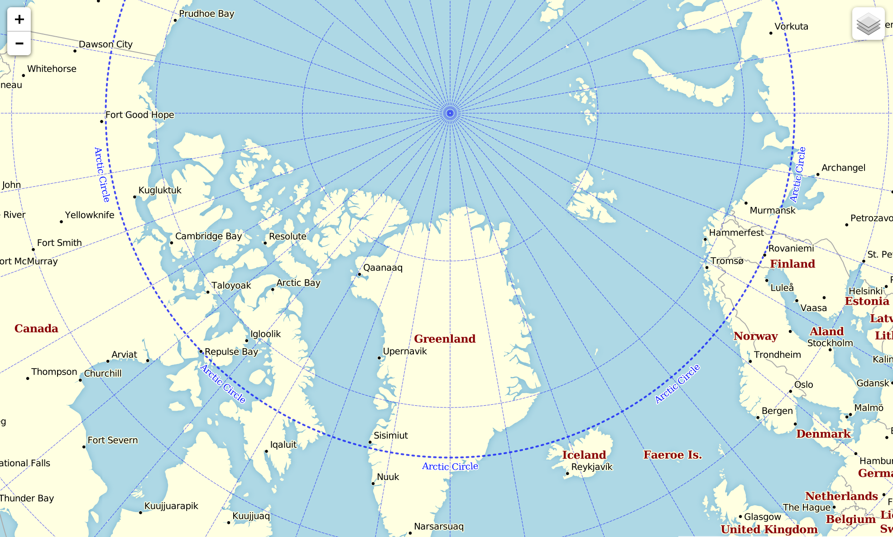

.. _quickstart:

Quick Start
***********

.. highlight:: console

After you have installed everything using :doc:`install` manual,
the `stonemason` CLI should be available as ``stonemason``::

    $ stonemason --version
    Stonemason 0.2.0

If you prefer to run `stonemason` in "in place" mode, the
package itself is also executable::

    $ git clone https://github.com/Kotaimen/stonemason.git
    $ cd stonemason
    $ python -m stonemason
    Stonemason 0.2.0

`stonemason` uses `Click <http://click.pocoo.org>`_ as argument parser, so
getting help is a bit different from other multi command tools like `git`::

    $ stonemason --help
    $ stonemason tileserver --help

Initialize Gallery
==================

`stonemason` must have a `gallery` predefined, where all map themes, designs,
render directives, storage configurations are assembled together.

Themes root can be passed as ``--gallery`` option, or defined in
``STONEMASON_GALLERY`` envvar.

To init a gallery, use ``init`` command, it will create the directory
structure and configurations for you, with a simple sample theme::

    $ stonemason --gallery=map_gallery init
    Initialization complete, start a tile server using:
            export STONEMASON_GALLERY=/Users/kotaimen/proj/python/stonemason/map_gallery
            stonemason -dd tileserver
    Or check configuration using:
            stonemason --gallery=/Users/kotaimen/proj/python/stonemason/map_gallery check

Check Configuration
===================

To verify theme configuration, use ``check`` subcommand::

    $ stonemason --gallery=map_gallery check
    Checking configuration at /Users/kotaimen/proj/python/stonemason/map_gallery...
    Theme: sample
            Schema: sample .png
            Schema: sample @2x.png
            Schema: sample @3x.png
            Schema: sample @4x.png
    Theme: sample_jpeg
            Schema: sample_jpeg .jpg;quality=poor
            Schema: sample_jpeg .jpg;quality=good
            Schema: sample_jpeg .jpg;quality=medium
    Theme: proj
            Schema: proj _EPSG:3857(Google_Mercator)@2x.png
            Schema: proj _EPSG:3574(North_Pole_LAEA_Atlantic)@2x.png
            Schema: proj _EPSG:102020(South_Pole_Lambert_Azimuthal_Equal_Area)@2x.png
            Schema: proj _EPSG:54014(Eckert_II)@2x.png
            Schema: proj _EPSG:54028(World_Cassini)@2x.png
            Schema: proj _EPSG:102003(USA_Contiguous_Equal_Area_Conic)@2x.png
            Schema: proj _EPSG:102005(USA_Contiguous_Equidistant_Conic)@2x.png
            Schema: proj _EPSG:30178(Japan_Plane_Rectangular_CS_XVIII)@2x.png
            Schema: proj _EPSG:3577(Australian_Albers)@2x.png
    Theme: sample_mapnikcomposer
            Schema: sample_mapnikcomposer .png
            Schema: sample_mapnikcomposer @2x.png
    Theme: sample_magick
            Schema: sample_magick .png
            Schema: sample_magick @2x.png
    Check completed.

Configure Memcache
====================

.. sidebar:: Tip

    Even if a memcache cluster is used, you can still configure tileserver
    to listen ``localhost:11211`` by using a memcache proxy like
    `Twitter's nutcracker <https://github.com/twitter/twemproxy>`_.

To start serving tiles, a memcache server is required, the sample theme
generated above requires one listening on local TCP port ``11211``::

    $ telnet localhost 11211
    Trying 127.0.0.1...
    Connected to localhost.
    Escape character is '^]'.
    stats
    STAT pid 4648
    STAT uptime 1981
    STAT time 1423105263
    STAT version 1.4.20
    ...
    ...
    STAT crawler_reclaimed 0
    END

Configure Redis
===============

Redis is used in distributed deployment as message queue, which is not
required in the quickstart.

Tile Server
===========

After created a sample themes root, you can start the tile server::

    $ export STONEMASON_GALLERY=`~/map_gallery`
    $ stonemason -dd tileserver --bind=127.0.0.1:8000

The ``-dd`` option means a debugging flask server will be started, to start
To production server using `Gunicorn`, don't supply the ``-dd`` option::

    $ stonemason tileserver --bind=0.0.0.0:8000
    [2015-03-02 18:09:30 +0800] [42985] [INFO] Starting gunicorn 19.2.1
    [2015-03-02 18:09:30 +0800] [42985] [INFO] Listening at: http://127.0.0.1:7086 (42985)
    [2015-03-02 18:09:30 +0800] [42985] [INFO] Using worker: sync
    [2015-03-02 18:09:30 +0800] [43013] [INFO] Booting worker with pid: 43013
    [2015-03-02 18:09:31 +0800] [43014] [INFO] Booting worker with pid: 43014

Open http://localhost:7086 in the browser, you should see a start page like
this:

    Start page

.. note:: The console requires internet connection since javascript assets
    are downloaded from CDN distribution.

When the built in `Gunicorn` server is used, you can specify number
of worker processes used and number of threads per worker::

    $ stonemason tileserver --bind=0.0.0.0:8000 --workers=2 --threads=4
    [2015-03-02 18:10:00 +0800] [43027] [INFO] Starting gunicorn 19.2.1
    [2015-03-02 18:10:00 +0800] [43027] [INFO] Listening at: http://127.0.0.1:7086 (43027)
    [2015-03-02 18:10:00 +0800] [43027] [INFO] Using worker: threads
    [2015-03-02 18:10:00 +0800] [43054] [INFO] Booting worker with pid: 43054
    [2015-03-02 18:10:00 +0800] [43055] [INFO] Booting worker with pid: 43055

If you have `memcache` server configured above, use it to caching tiles::

    $ stonemason tileserver --bind=0.0.0.0:8000 --workers=2 --threads=2 --cache=localhost:11211

Or define it in envvar ``STONEMASON_CACHE``::

    $ export STONEMASON_CACHE=localhost:11211

If a memcache cluster is used, separate each node with ``;`` or space::

    $ export STONEMASON_CACHE=10.0.16.1:11211;10.0.16.2:11211

This caches rendered tiles and speed up map browsing considerably, to view
map, click the little marker icon on the right top of the panel:

    Sample World (Google Mercator)

The sample contains several themes and schemas which demonstrates flexibility
of the configuration format:

    Variable Depth Haloing using ImageMagick Composer

    North Pole LAEA Atlantic Projection

Deployment
==========

If you want to use another `WSGI` server or customized `Gunicorn`
configuration, generate one using tileserver's ``--write-wsgi`` option::

    $ stonemason tileserver --cache=localhost:11211 --write-wsgi=application.py

This writes ``application.py``:

.. code-block:: python

    #! -*- coding: ascii -*-
    from stonemason.service.tileserver import TileServerApp
    config = {   'STONEMASON_CACHE': 'localhost:11211',
        'STONEMASON_DEBUG': False,
        'STONEMASON_MAX_AGE': 300,
        'STONEMASON_READ_ONLY': False,
        'STONEMASON_GALLERY': '/home/ubuntu/themes',
        'STONEMASON_VERBOSE': 0}
    application = TileServerApp(**config)

To serve this application using `Gunicorn`, run::

    $ gunicorn -b 0.0.0.0:8080 application -w 4

Docker Container
================

We also provided a official base docker image which can be used to quickly
build a sample tile service:

.. code-block:: Dockerfile

    FROM        kotaimen/stonemason-dev
    MAINTAINER  Kotaimen <kotaimen.c@gmail.com>

    ENV         DEBIAN_FRONTEND noninteractive

    WORKDIR     /var/stonemason
    # Or, COPY your gallery here
    RUN         stonemason init

    EXPOSE      80
    ENTRYPOINT  ["stonemason", "tileserver", "--bind=0.0.0.0:80"]

To start tileserver in docker container, use::

    $ docker build -t stonemason-sample .
    $ docker run -p 0.0.0.0:8080:80 stonemason-sample
    [2015-03-02 18:10:00 +0800] [43027] [INFO] Starting gunicorn 19.2.1
    [2015-03-02 18:10:00 +0800] [43027] [INFO] Listening at: http://0.0.0.0:7086 (43027)
    [2015-03-02 18:10:00 +0800] [43027] [INFO] Using worker: threads
    [2015-03-02 18:10:00 +0800] [43054] [INFO] Booting worker with pid: 43054

Renderer
========

When a theme is configured with proper tile storage, you can pre-render some of
the map coverage, for the ``sample`` map theme::

    $ stonemason tilerenderer sample .png -l 2-6
    [INFO/MainProcess] allocating a new mmap of length 4096
    [INFO/producer] child process calling self.run()
    [INFO/producer] Started spawning metatiles from #0
    [INFO/producer] Stopped after spawn #86 metatiles.
    [INFO/producer] process shutting down
    [INFO/producer] process exiting with exitcode 0
    [INFO/renderer#0] child process calling self.run()
    [INFO/renderer#0] Rendering MetaTileIndex(2/0/0@4)
    ...
    [INFO/renderer#1]   MetaTileIndex(6/56/56@8) rendered in 2.3370s
    [INFO/MainProcess] ===== Completed =====
    Succeeded MetaTiles : 86
       Failed MetaTiles : 0
         Total CPU Time : 5.03m
             Time Taken : 1.28m
           Render Speed : 3.5088s/MetaTile

Depends on the hardware configuration, it may take several minutes to complete,
rendered result is stored in a ``cluster`` zip file to improve filesystem
performance::

    $ find  map_gallery/sample_world/cache/sample
    map_gallery/sample_world/cache/sample
    map_gallery/sample_world/cache/sample/02
    map_gallery/sample_world/cache/sample/02/2-0-0@4.zip
    map_gallery/sample_world/cache/sample/03
    map_gallery/sample_world/cache/sample/03/3-0-0@8.zip
    map_gallery/sample_world/cache/sample/04
    map_gallery/sample_world/cache/sample/04/4-0-0@8.zip
    map_gallery/sample_world/cache/sample/04/4-0-8@8.zip
    map_gallery/sample_world/cache/sample/04/4-8-0@8.zip
    map_gallery/sample_world/cache/sample/04/4-8-8@8.zip
    ...

For very large maps, rendering entire coverage usually takes too much time and
storage space.  You can configure the renderer to render a tile list covers
hot areas (densely populated cities, high levels, etc)::

    $ stonemason tilerenderer sample .png --levels=11,12 --csv=TileBitmap/usa/usa_cityarea_08.csv

