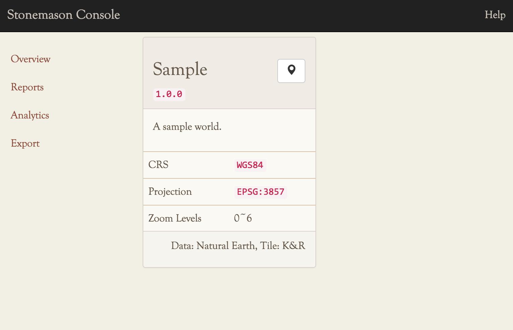
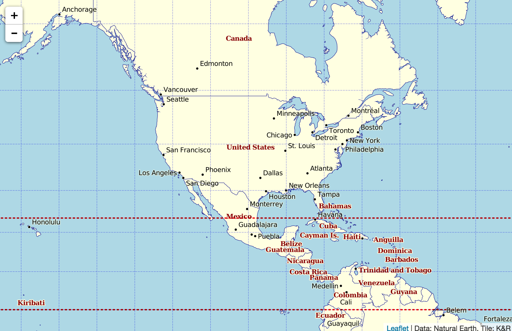
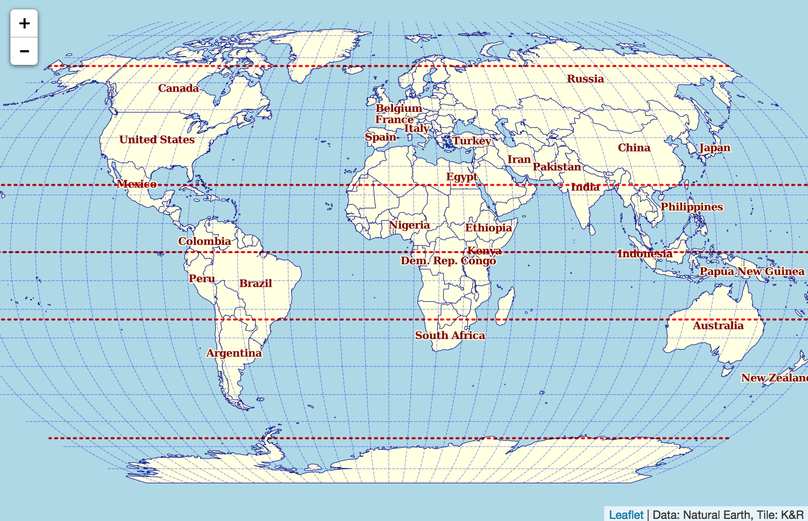

.. _quickstart:

Quick Start
***********

.. highlight:: console

After you have installed everything using :doc:`install` manual, or, from `pip`,
the `stonemason` CLI should be available as ``stonemason``::

    $ stonemason --version
    Stonemason 0.2.0

If you prefer to run `stonemason` in "in place" mode, the
package itself is also executable::

    $ cd stonemason
    $ python -m stonemason
    Stonemason 0.2.0

`stonemason` uses `Click <http://click.pocoo.org>`_ as argument parser, so
getting help is a bit different from other multi command tools like `git`::

    $ stonemason --help
    $ stonemason tileserver --help

Initialize Theme Root
=====================

`stonemason` must have a `themes root` predefined, where all map designs,
render directives, storage configurations are assembled together.

Themes root can be passed as ``--themes`` option, or defined in
``STONEMASON_GALLERY`` envvar.

To init a themes root, use ``init`` command, it will create the directory
structure and configurations for you, with a simple sample theme::

    $ mkdir ~/themes
    $ stonemason --themes=themes init
    Initialization complete, start a tile server using:
        export STONEMASON_GALLERY=/Users/kotaimen/proj/python/stonemason/themes
        stonemason -dd tileserver
    Or check configuration using:
        stonemason --themes=/Users/kotaimen/proj/python/stonemason/themes check

Check Theme Configuration
=========================

To verify theme configuration, use ``check`` subcommand::

    $ stonemason --themes=themes -v check
    Checking themes configuration at /Users/kotaimen/proj/python/stonemason/themes...
    name="sample"
        ...
        ...
    Check completed.

Configure a Memcache
====================

.. sidebar:: Tip

    Even if a memcache cluster is used, you can still configure tileserver
    to listen ``localhost:11211`` by using a memcache proxy like
    `Twitter's nutcracker <https://github.com/twitter/twemproxy>`_.

To start serving tiles, a memcache server is required, the sample theme
generated above requires one listening on local TCP port ``11211``::

    $ telnet localhost 11211
    Trying 127.0.0.1...
    Connected to localhost.
    Escape character is '^]'.
    stats
    STAT pid 4648
    STAT uptime 1981
    STAT time 1423105263
    STAT version 1.4.20
    ...
    ...
    STAT crawler_reclaimed 0
    END

Configure Redis
===============

Redis is used in distributed deployment as message queue, which is not
required in the quickstart.

Tile Server
===========

After created a sample themes root, you can start the tile server::

    $ export STONEMASON_GALLERY=`~/themes`
    $ stonemason -dd tileserver --bind=127.0.0.1:8000

The ``-dd`` option means a debugging flask server will be started, to start
To production server using `Gunicorn`, don't supply the ``-dd`` option::

    $ stonemason tileserver --bind=0.0.0.0:8000
    [2015-03-02 18:09:30 +0800] [42985] [INFO] Starting gunicorn 19.2.1
    [2015-03-02 18:09:30 +0800] [42985] [INFO] Listening at: http://127.0.0.1:7086 (42985)
    [2015-03-02 18:09:30 +0800] [42985] [INFO] Using worker: sync
    [2015-03-02 18:09:30 +0800] [43013] [INFO] Booting worker with pid: 43013
    [2015-03-02 18:09:31 +0800] [43014] [INFO] Booting worker with pid: 43014

Open http://localhost:7086 in the browser, you should see a start page like
this:

    Start page

.. note:: The console requires internet connection since javascript assets
    are downloaded from our CDN distribution.

When `Gunicorn` server is used, you can specify number of worker processes used
and number of threads per worker::

    $ stonemason tileserver --bind=0.0.0.0:8000 --workers=2 --threads=4
    [2015-03-02 18:10:00 +0800] [43027] [INFO] Starting gunicorn 19.2.1
    [2015-03-02 18:10:00 +0800] [43027] [INFO] Listening at: http://127.0.0.1:7086 (43027)
    [2015-03-02 18:10:00 +0800] [43027] [INFO] Using worker: threads
    [2015-03-02 18:10:00 +0800] [43054] [INFO] Booting worker with pid: 43054
    [2015-03-02 18:10:00 +0800] [43055] [INFO] Booting worker with pid: 43055

If you have `memcache` server configured above, use it to caching tiles::

    $ stonemason tileserver --bind=0.0.0.0:8000 --workers=2 --threads=2 --cache=localhost:11211

Or define it in envvar ``STONEMASON_CACHE``::

    $ export STONEMASON_CACHE=localhost:11211

If a memcache cluster is used, separate each node with ``;`` or space::

    $ export STONEMASON_CACHE=10.0.16.1:11211;10.0.16.2:11211

This caches rendered tiles and speed up map browsing considerably, to view
map, click the little marker icon on the right top of the panel:

    Sample World (Google Mercator)

Modify Theme
============

Open the ``sample_world.json`` file in themes root directory above in a text
editor, locate ``pyramid`` section:

.. code-block:: javascript
   :emphasize-lines: 14-27

    {
      "name": "sample",
      "maptype": "image",
      "metadata": {
        "version": "1.0.0",
        "description": "A sample world.",
        "attribution": "Data: Natural Earth, Tile: K&R",
        "center": [
          0,
          0
        ],
        "center_zoom": 0
      },
      "pyramid": {
        "stride": 2,
        "geogcs": "WGS84",
        "projcs": "EPSG:54030",
        "levels": [
          0,
          1,
          2,
          3,
          4,
          5,
          6
        ]
      },
      "cache": {
        "prototype": "null"
      },
      "design": {
        "tileformat": {
          "format": "PNG",
          "extension": "png"
        },
        "layers": {
          "root": {
            "type": "image.mapnik",
            "style_sheet": "sample_world/sample_world.xml",
            "default_scale": 2,
            "buffer_size": 256
          }
        }
      }
    }

Change ``"projcs"`` from ``"EPSG:3857"`` to ``"EPSG:54030"`` and restart the
tile server, now you have a map with `Robinson` projection!

    Sample World (Robinson)

Deployment
==========

If you want to use another `WSGI` server or customized `Gunicorn`
configuration, generate one using tileserver's ``--write-wsgi`` option::

    $ stonemason tileserver --cache=localhost:11211 --write-wsgi=application.py

This writes ``application.py``:

.. code-block:: python

    #! -*- coding: ascii -*-
    from stonemason.service.tileserver import TileServerApp
    config = {   'STONEMASON_CACHE': 'localhost:11211',
        'STONEMASON_DEBUG': False,
        'STONEMASON_MAX_AGE': 300,
        'STONEMASON_READ_ONLY': False,
        'STONEMASON_GALLERY': '/home/ubuntu/themes',
        'STONEMASON_VERBOSE': 0}
    application = TileServerApp(**config)

To serve this application using `Gunicorn`, run::

    $ gunicorn -b 0.0.0.0:8080 application -w 4

Docker
======

Here is a sample `Docker` configuration which assumes a dist package in
``dist/`` and themes in ``themes/`` along the ``Dockerfile``:

.. literalinclude:: ../Dockerfile
   :language: Dockerfile

To start tileserver in docker container, use::

    $ docker build -t stonemason .
    $ docker run -p 0.0.0.0:7086:7086 stonemason stonemason tileserver --bind 0.0.0.0:7086 --workers=1
    [2015-03-02 18:10:00 +0800] [43027] [INFO] Starting gunicorn 19.2.1
    [2015-03-02 18:10:00 +0800] [43027] [INFO] Listening at: http://0.0.0.0:7086 (43027)
    [2015-03-02 18:10:00 +0800] [43027] [INFO] Using worker: threads
    [2015-03-02 18:10:00 +0800] [43054] [INFO] Booting worker with pid: 43054

