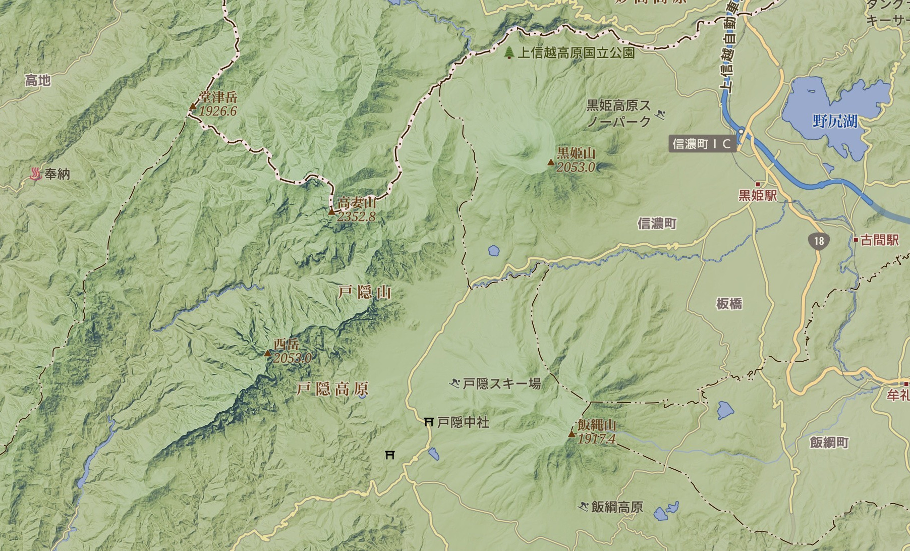

.. stonemason documentation master file, created by
    sphinx-quickstart on Tue Jan 13 12:30:07 2015.
    You can adapt this file completely to your liking, but it should at least
    contain the root `toctree` directive.

##########
Stonemason
##########

*Stonemason* is a tile map service toolkit developed in Python.

   Shaded relief map near Mt. Kurohime.

.. figure:: _static/newspaper.png
   :width: 100 %
   :alt: Newspaper
   :align: center

   Mimics a halftone printed newspaper.

User's Guide
############

.. toctree::
    :maxdepth: 1

    guide_install
    guide_quickstart
    guide_concept
    guide_gallery
    guide_config

API Reference
#############

.. toctree::
    :maxdepth: 2

    pkg_mason
    pkg_theme

.. toctree::
    :maxdepth: 2

    pkg_tileserver
    pkg_renderman

.. toctree::
    :maxdepth: 2

    pkg_pyramid
    pkg_tilecache
    pkg_tilestorage
    pkg_formatbundle

.. toctree::
    :maxdepth: 2

    pkg_renderer

.. toctree::
    :maxdepth: 2

    pkg_util

REST API Reference
##################

.. toctree::
    :maxdepth: 2

    service_tileserver

Indices and tables
##################

* :ref:`genindex`
* :ref:`modindex`
* :ref:`search`

