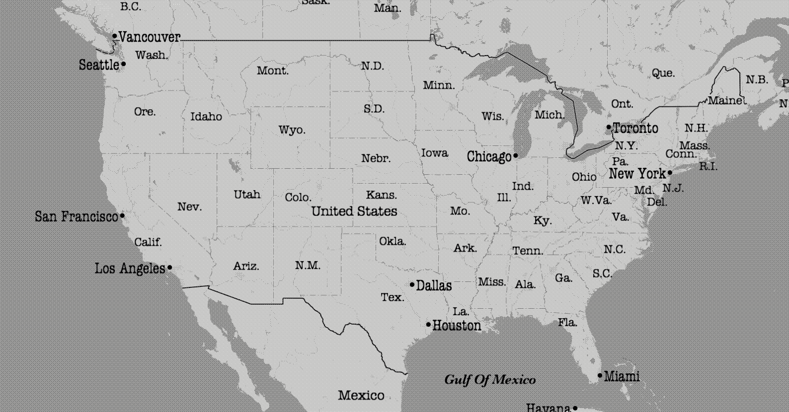

.. stonemason documentation master file, created by
    sphinx-quickstart on Tue Jan 13 12:30:07 2015.
    You can adapt this file completely to your liking, but it should at least
    contain the root `toctree` directive.

##########
Stonemason
##########

*Stonemason* is a tile map service toolkit developed in Python.

   Newspaper

User's Guide
############

.. toctree::
    :maxdepth: 1

    install
    quickstart
    config
    themes
    xlarge

API Reference
#############

.. toctree::
    :maxdepth: 2

    pkg_service

.. toctree::
    :maxdepth: 2

    pkg_theme

.. toctree::
    :maxdepth: 2

    pkg_pyramid
    pkg_tileprovider
    pkg_tilecache
    pkg_tilestorage
    pkg_formatbundle

.. toctree::
    :maxdepth: 2

    pkg_composer

.. toctree::
    :maxdepth: 2

    pkg_util

REST API Reference
##################

.. toctree::
    :maxdepth: 2

    service_tileserver

Indices and tables
##################

* :ref:`genindex`
* :ref:`modindex`
* :ref:`search`

